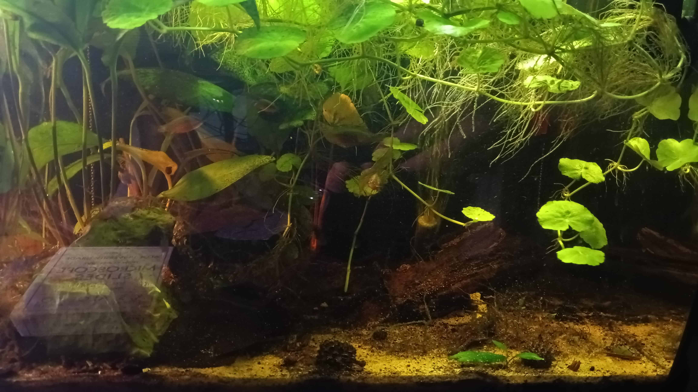
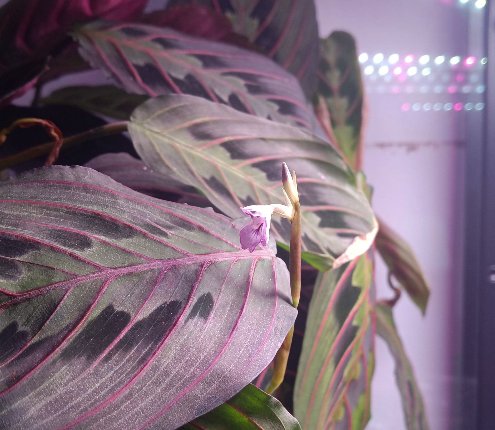

My name is Sophia Gosselin (she/her/hers) and I am currently a PhD student at the University of Connecticut. I work within the [Gogarten lab](https://j.p.gogarten.uconn.edu/) studying the evolution of mobile genetic elements, viruses, and bacteria. If you are interested in my previous publications, research interests, or anything else science related, then you can find more on my [research page](/research.md).

From a young age I have always been interested in biology - I have spent innumerable afternoons as a child investigating local streams and swamps - and this has carried into aulthood. I maintain several small aquariums, and reguarly pull out my personal microscope to investigate ever-growing mircoscopic biodiversity therein.

 

I spend a significant amount of time at UConn's botanical greenhouse; enjoying the vast biological collection, and volunteering with plant care and data collection. While at home I also maintain a small cabinet greenhouse in my home  (the plants must be protected from the ravages of overly-curious kittens).

Outside of biology I hold a deep pasion for story telling, history, and existential horror. This has in turn evolved into a love of table-top RPG's, world building, and fiction writing. Interests that I will be more than happy to speak at length about if asked. 
