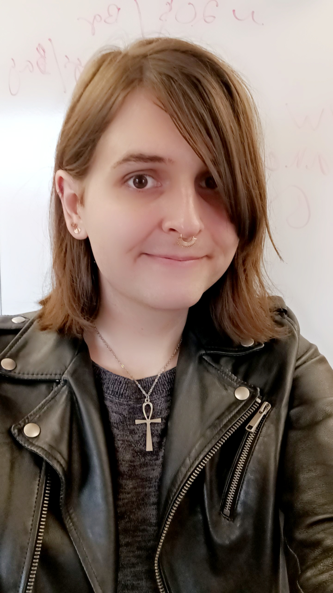

---
# Feel free to add content and custom Front Matter to this file.
# To modify the layout, see https://jekyllrb.com/docs/themes/#overriding-theme-defaults

layout: home
---

#### Hello and welcome! 

<html>
  <head>
    <title>Home Page</title>
  </head>
  
  <body>
    

      

        
      

      

        <h1>My name is Sophia Gosselin, and I am a bioinformatician, evolutionary biologist, and weird snail person all rolled up into one. If you wish to know anything about me, see my <a href="about.md">about me page</a>. Otherwise all of my research interests are located <a href="research.md">here</a>. Thank you for visiting!</h1>
      

    

  </body>
</html>